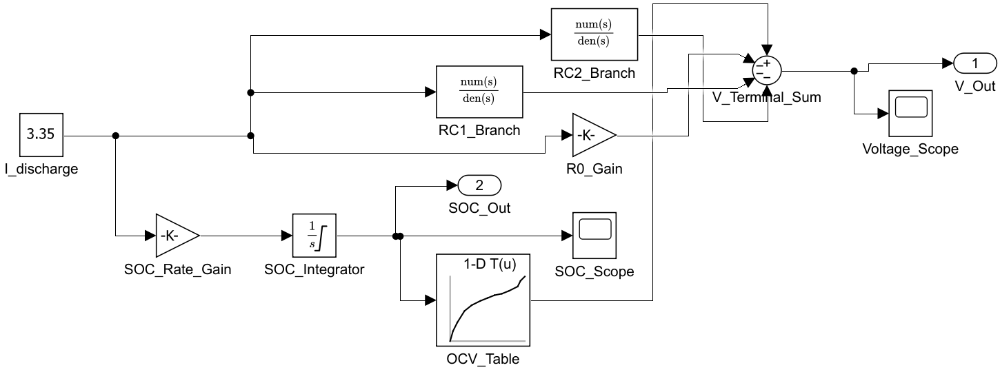

# NCR18650B Thevenin ECM — Architecture & Block Reference

## 1. Model Purpose

The model (`ncr18650b_thevenin.slx`) simulates the electrical behaviour of a single Panasonic NCR18650B lithium-ion cell under a constant 1C discharge load. It implements a **second-order Thevenin Equivalent Circuit Model (ECM)**, the standard industry approach for battery state estimation in BMS and HIL applications.

The model answers two questions at every point in time:
- What is the **terminal voltage** the cell delivers to the load?
- What is the **state of charge** remaining in the cell?

---

## 2. Physical Basis

A real battery is not a simple voltage source. When current flows, three distinct voltage drop mechanisms act simultaneously:

| Mechanism | Physical cause | Time scale |
|---|---|---|
| Ohmic drop (R0) | Electrolyte and contact resistance | Instantaneous |
| Fast polarisation (RC1) | Charge-layer dynamics at electrode surface | ~27 s |
| Slow polarisation (RC2) | Solid-state diffusion inside electrode particles | ~32 s |
| OCV change | Electrochemical potential shift with lithium inventory | Minutes–hours |

The Thevenin ECM captures all four effects with lumped circuit elements.

---

## 3. System Architecture

### 3.1 Block Diagram



### 3.2 Two Parallel Computation Paths

The model has two coupled signal paths that feed the terminal voltage calculation:

**Path A — SOC & OCV (slow, integrating)**
```
I_discharge → SOC_Rate_Gain → SOC_Integrator → OCV_Table → V_Terminal_Sum(+)
```
Tracks how much charge has been consumed (Coulomb counting) and maps the remaining SOC to an open-circuit voltage via a nonlinear lookup table.

**Path B — Voltage drops (fast, algebraic + dynamic)**
```
I_discharge → R0_Gain             → V_Terminal_Sum(−)   [instantaneous]
I_discharge → RC1_Branch (TF)     → V_Terminal_Sum(−)   [τ ≈ 27 s]
I_discharge → RC2_Branch (TF)     → V_Terminal_Sum(−)   [τ ≈ 32 s]
```
Computes all three voltage drops caused by the discharge current flowing through the equivalent circuit impedance.

### 3.3 Terminal Voltage Equation

```
V_terminal(t) = OCV(SOC(t))  −  R0·I  −  V_RC1(t)  −  V_RC2(t)
```

Where:
- `OCV(SOC)` is read from the lookup table
- `R0·I` is the instantaneous ohmic drop
- `V_RC1`, `V_RC2` are the voltages across each RC branch (governed by first-order dynamics)

### 3.4 RC Branch Dynamics

Each RC branch is modelled as a first-order transfer function:

```
V_RC(s)     R
──────── = ────────        (R·C = τ)
 I(s)      τs + 1
```

In the time domain: `dV_RC/dt = (R·I − V_RC) / τ`

This means the RC voltage builds up exponentially toward `R·I` and decays exponentially when current changes.

---

## 4. Block-by-Block Reference

---

### `I_discharge` — Constant

**Type:** `Constant`  
**Output:** 3.35 A (fixed scalar)

**Role:** Represents the external load drawing current from the cell. Set to 3.35 A, which is the 1C rate for a 3350 mAh cell (1C = capacity in Ah = 3.35 A).

**Signal fan-out:** This single block drives four downstream blocks simultaneously — `SOC_Rate_Gain`, `R0_Gain`, `RC1_Branch`, and `RC2_Branch`. It is the only input to the entire model.

**To change the load profile:** Replace with a Signal Builder, From Workspace, or a time-varying expression block.

---

### `SOC_Rate_Gain` — Gain

**Type:** `Gain`  
**Gain value:** −8.2918 × 10⁻⁵  
**Expression:** `y = −(1/Q_cell) · I`

**Role:** Converts the discharge current into a rate of SOC decrease. The gain encodes the cell capacity:

```
Q_cell = 3.35 Ah = 3.35 × 3600 As = 12 060 C

gain = −1 / 12 060 = −8.2918×10⁻⁵  (s⁻¹ per ampere)
```

At I = 3.35 A, the output is −2.778×10⁻⁴ per second, so SOC decreases from 1.0 to 0.0 in exactly 3600 s.

The negative sign is deliberate: discharge current removes charge, so SOC must decrease.

---

### `SOC_Integrator` — Integrator

**Type:** `Integrator`  
**Initial condition:** 1.0 (100% SOC)  
**Output limits:** clamped to [0, 1]  
**Expression:** `SOC(t) = 1 − ∫₀ᵗ (I/Q) dt`

**Role:** The cell's state memory. Integrates the SOC rate to produce a continuous SOC signal in [0, 1]. The initial condition of 1.0 sets the cell as fully charged at t = 0.

The output saturation at [0, 1] prevents nonphysical SOC values (below 0% or above 100%) in the event of numerical drift or extended simulation beyond cutoff.

**Fan-out:** Feeds three blocks — `OCV_Table` (for voltage), `SOC_Scope` (display), and `SOC_Out` (logged output).

---

### `OCV_Table` — 1-D Lookup Table

**Type:** `Lookup_n-D` (1-D mode)  
**Input:** SOC ∈ [0, 1]  
**Output:** Open-circuit voltage (V)

**Role:** Implements the nonlinear OCV–SOC characteristic of the NCA/graphite chemistry. This is the most important nonlinearity in the model — the OCV curve shape determines the voltage plateau, the end-of-discharge knee, and the model accuracy.

**Lookup table data:**

| SOC | OCV (V) | Region |
|---|---|---|
| 0.00 | 2.65 | Fully depleted |
| 0.05 | 2.90 | End-of-discharge knee |
| 0.10 | 3.10 | Knee slope |
| 0.20 | 3.40 | Lower transition |
| 0.30 | 3.55 | Plateau entry |
| 0.40 | 3.65 | Mid plateau |
| 0.50 | 3.72 | Mid plateau |
| 0.60 | 3.78 | Mid plateau |
| 0.70 | 3.83 | Mid plateau |
| 0.80 | 3.90 | Upper plateau |
| 0.90 | 4.00 | Upper transition |
| 0.95 | 4.12 | Near full |
| 1.00 | 4.25 | Fully charged |

Between breakpoints, Simulink interpolates linearly. The steep drop between SOC = 0.1 and SOC = 0.0 represents the end-of-discharge voltage collapse characteristic of NCA cells.

---

### `R0_Gain` — Gain

**Type:** `Gain`  
**Gain value:** 0.0483 Ω  
**Expression:** `V_R0 = R0 · I = 0.0483 × 3.35 = 0.162 V`

**Role:** Models the **ohmic resistance** of the cell — the instantaneous, frequency-independent voltage drop caused by electrolyte ionic resistance, current-collector resistance, and tab/contact resistance.

This is a purely algebraic (memoryless) block: its output changes instantly with current, producing the sharp step in terminal voltage visible at t = 0 in the Scope.

R0 = 0.0483 Ω is derived from electrochemical impedance spectroscopy (EIS) of the NCR18650B cell.

---

### `RC1_Branch` — Transfer Function

**Type:** `TransferFcn`  
**Transfer function:** `H₁(s) = 0.0245 / (27.53s + 1)`  
**Parameters:** R1 = 0.0245 Ω, C1 = 1124 F, τ1 = R1·C1 = 27.53 s  
**Expression:** `V_RC1(s) = H₁(s) · I(s)`

**Role:** Models the **fast polarisation** dynamics — the voltage drop that builds up and relaxes with a ~27-second time constant. Physically this represents the double-layer capacitance at the electrode–electrolyte interface charging through the charge-transfer resistance.

At DC steady state (s → 0): `V_RC1 = R1·I = 0.0245 × 3.35 = 0.082 V`  
At t = 0 (step current applied): `V_RC1 = 0` (capacitor is uncharged)  
After ~5τ ≈ 138 s: `V_RC1` has settled to its steady-state value.

---

### `RC2_Branch` — Transfer Function

**Type:** `TransferFcn`  
**Transfer function:** `H₂(s) = 0.0080 / (32.41s + 1)`  
**Parameters:** R2 = 0.0080 Ω, C2 = 4051 F, τ2 = R2·C2 = 32.41 s  
**Expression:** `V_RC2(s) = H₂(s) · I(s)`

**Role:** Models the **slow polarisation** dynamics — a second RC branch with a longer time constant (~32 s) and lower resistance. Physically this represents solid-state lithium diffusion in the electrode particles (diffusion overpotential), which is slower and smaller in magnitude than the charge-transfer polarisation.

At DC steady state: `V_RC2 = R2·I = 0.0080 × 3.35 = 0.027 V`  
The two RC branches together contribute 0.109 V of dynamic polarisation at steady discharge.

---

### `V_Terminal_Sum` — Sum

**Type:** `Sum`  
**Signs:** `+−−−` (4 inputs)  
**Expression:** `V_terminal = OCV − V_R0 − V_RC1 − V_RC2`

**Role:** Assembles the four voltage contributions into the observable terminal voltage. Each minus sign subtracts a voltage drop from the open-circuit potential:

| Port | Source | Sign | Contribution at t ≫ τ |
|---|---|---|---|
| u1 | `OCV_Table` | + | +3.72 V (at SOC=0.5) |
| u2 | `R0_Gain` | − | −0.162 V |
| u3 | `RC1_Branch` | − | −0.082 V |
| u4 | `RC2_Branch` | − | −0.027 V |
| **y1** | **V_terminal** | | **≈ 3.45 V** |

---

### `Voltage_Scope` — Scope

**Type:** `Scope`  
**Input:** `V_Terminal_Sum.y1`

**Role:** Displays the terminal voltage waveform in real time during simulation. The trace shows the characteristic Li-ion discharge profile: initial ohmic step, mid-discharge plateau (~3.7–3.9 V), and end-of-discharge voltage collapse.

---

### `SOC_Scope` — Scope

**Type:** `Scope`  
**Input:** `SOC_Integrator.y1`

**Role:** Displays the SOC waveform. For a constant-current discharge the SOC decreases as a straight line from 1.0 to 0.0 over 3600 s, confirming that Coulomb counting is working correctly.

---

### `V_Out` — Outport (port 1)

**Type:** `Out1`  
**Output port index:** 1

**Role:** Exposes the terminal voltage signal to the MATLAB workspace via `out.yout{1}` after simulation. Used for post-processing, analysis, and automated test assertions.

---

### `SOC_Out` — Outport (port 2)

**Type:** `Out1`  
**Output port index:** 2

**Role:** Exposes the SOC signal to the MATLAB workspace via `out.yout{2}`. Enables downstream analysis of discharge capacity, cutoff timing, and SOC accuracy without re-running the simulation.

---

## 5. Signal Summary

| Signal | Source block | Destination(s) | Units | Range |
|---|---|---|---|---|
| I (current) | `I_discharge` | `SOC_Rate_Gain`, `R0_Gain`, `RC1_Branch`, `RC2_Branch` | A | 3.35 (constant) |
| dSOC/dt | `SOC_Rate_Gain` | `SOC_Integrator` | s⁻¹ | −2.778×10⁻⁴ |
| SOC | `SOC_Integrator` | `OCV_Table`, `SOC_Scope`, `SOC_Out` | — | [0, 1] |
| OCV | `OCV_Table` | `V_Terminal_Sum` u1 | V | [2.65, 4.25] |
| V_R0 | `R0_Gain` | `V_Terminal_Sum` u2 | V | 0.162 |
| V_RC1 | `RC1_Branch` | `V_Terminal_Sum` u3 | V | [0, 0.082] |
| V_RC2 | `RC2_Branch` | `V_Terminal_Sum` u4 | V | [0, 0.027] |
| V_terminal | `V_Terminal_Sum` | `Voltage_Scope`, `V_Out` | V | [2.38, 4.09] |

---

## 6. Simulation Results Summary

| Metric | Value |
|---|---|
| Terminal voltage at t = 0 | 4.088 V |
| 2.5 V cutoff time | 3554.7 s (59.2 min) |
| SOC at cutoff | 1.3% |
| Terminal voltage at t = 3600 s | 2.379 V |
